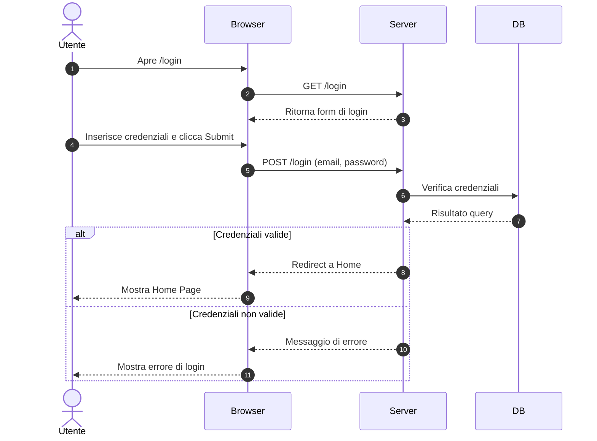

# 40 — UI Flows

Inserisci i flussi principali prima, poi come extra gli altri

## Flusso 1: Login
1. GET /login (form)
2. POST /login (submit)
3. success → redirect a home / fail → messaggio errore

ESEMPIO diagramma di sequenza:

## Flusso 2: CRUD principale (ADMIN)
- Lista → crea → salva → conferma → modifica → salva → elimina/disabilita
