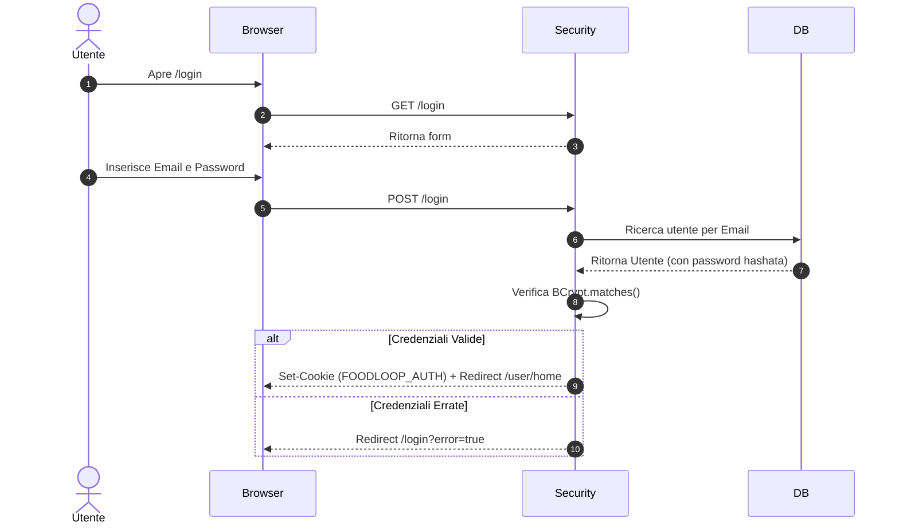
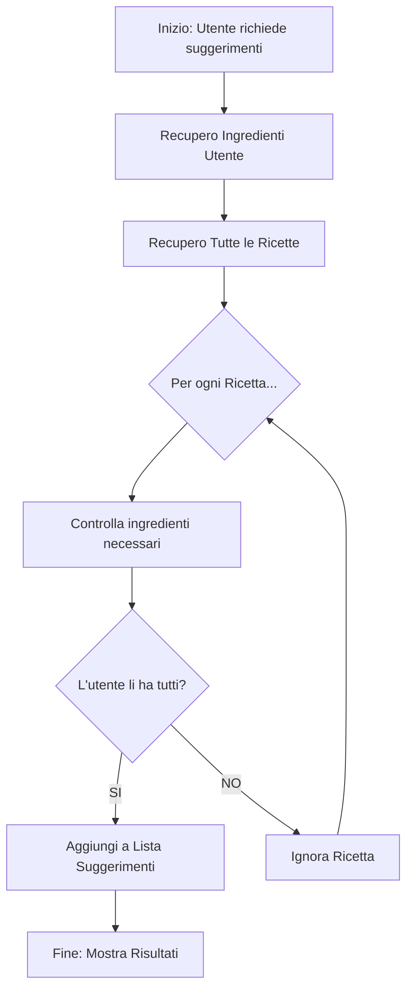

# 40 — UI Flows

## Flusso 1: Login e Autenticazione
Descrive il processo di accesso al sistema, fondamentale per identificare l'utente e caricare la sua dispensa personale.

1. **GET /login**: L'utente visualizza il form.
2. **POST /login**: Invio credenziali (email/password).
3. **Validazione**: `UserPasswordAuthProvider` verifica l'hash BCrypt.
4. **Successo**: Il `LoginSuccessHandler` crea la sessione e reindirizza alla Dashboard.
5. **Persistence**: Il `CookieFilter` garantisce che l'utente resti loggato nelle sessioni successive.

## Flusso 2: Gestione Dispensa (Ingrediente CRUD)
L'utente popola il sistema con i dati necessari per il calcolo delle ricette.

1. **Visualizzazione**: L'utente accede a `/ingredienti` (chiama `getByUtente`).
2. **Creazione**: Compilazione form (Nome, Scadenza, Categoria).
3. **Validazione**: Il sistema controlla se l'ingrediente è già presente per quell'utente (`uniqueErrorsForCreate`).
4. **Salvataggio**: L'ingrediente viene associato all'ID dell'utente loggato.

## Flusso 3: Creazione Ricetta con Upload
1. **Compilazione**: Inserimento dati DTO e selezione file immagine.
2. **Upload**: Il `FileStorageService` salva l'immagine su disco e restituisce il path.
3. **Mappatura**: `RicettaMapper` converte il DTO in Entità.
4. **Persistenza**: Salvataggio nel DB con riferimento al nome del file immagine.

## Flusso 4: Matching e Suggerimento Ricette
1. **Richiesta**: L'utente clicca su "Cosa posso cucinare?".
2. **Elaborazione**:
                    - Il sistema recupera tutti gli ingredienti dell'utente.
                    - Il sistema analizza tutte le ricette nel database.
                    - Viene eseguito un filtraggio: una ricetta è suggerita solo se **tutti** i suoi ingredienti sono presenti nella dispensa dell'utente (confronto *case-insensitive* sui nomi).

3. **Output**: Visualizzazione della lista di ricette "pronte all'uso".

